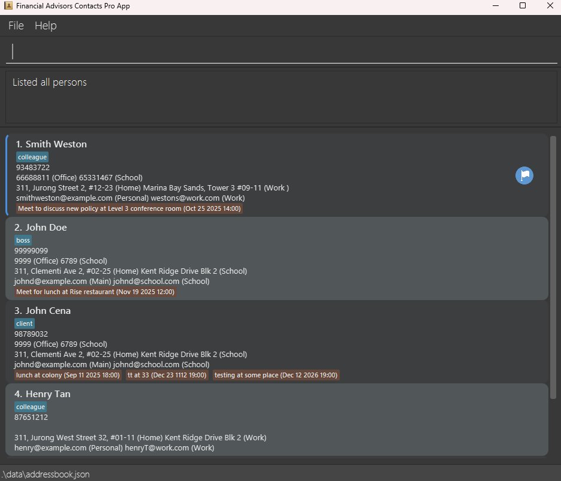
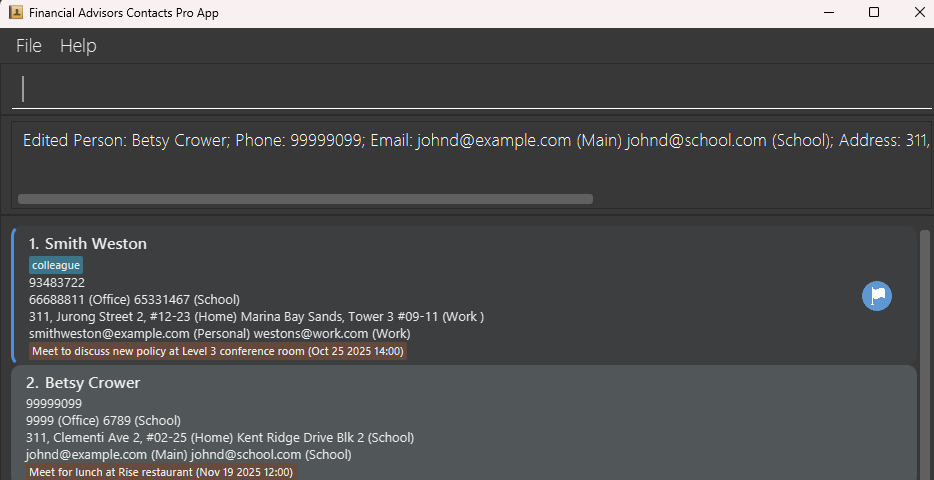
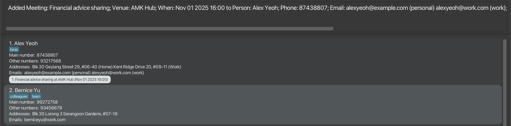

# FAContactsPro User Guide

Financial Advisor Contacts Pro (FAContactsPro) is a **desktop app tailored to financial advisors in Singapore for managing contacts, optimized for use via a Command Line Interface** (CLI) while still having the benefits of a Graphical User Interface (GUI). If you can type fast, FAContactsPro can get your contact management tasks done faster than traditional GUI apps.

<!-- * Table of Contents -->
<page-nav-print />

--------------------------------------------------------------------------------------------------------------------

## Quick start

1. Ensure you have Java `17` or above installed in your Computer. 
   **Mac users:** Ensure you have the precise JDK version prescribed [here](https://se-education.org/guides/tutorials/javaInstallationMac.html).

1. Download the latest `.jar` file from [here](https://github.com/AY2526S1-CS2103-F10-1/tp/releases).

1. Copy the file to the folder you want to use as the _home folder_ for your FAContactsPro AddressBook.

1. Open a command terminal, `cd` into the folder you put the jar file in, and use the `java -jar facontactspro.jar` command to run the application. 
   A GUI similar to the below should appear in a few seconds. Note how the app contains some sample data. 
   

1. Type the command in the command box and press Enter to execute it. e.g. typing **`help`** and pressing Enter will open the help window. 
   Some example commands you can try:

   * `list` : Lists all contacts.

   * `add n=John Doe mn=98765432 on=9999 (Office) 6789 (School) e=johnd@example.com (Main) johnd@work.com (Work) a=311, Clementi Ave 2, #02-25 (Home) Kent Ridge Drive Blk 2 (Office) t=colleague t=managers` : Adds a contact named `John Doe` to the Address Book.

   * `addmt p=1 m=Financial advice sharing v=AMK Hub w=2025-11-01 1600` : Adds a new meeting called `Financial advice sharing` to the first contact displayed in the Address Book.
   
   * `deletemt p=1 i=1` : Deletes the 1st meeting from the first contact shown in the current list.
   
   * `delete 3` : Deletes the 3rd contact shown in the current list.

   * `clear` : Deletes all contacts.

   * `exit` : Exits the app.

1. Refer to the [Features](#features) below for details of each command.

--------------------------------------------------------------------------------------------------------------------

## Features

<box type="info" seamless>

**Notes about the command format:** 

* Words in `UPPER_CASE` are the parameters to be supplied by the user. 
  e.g. in `add n=NAME`, `NAME` is a parameter which can be used as `add n=John Doe`.

* Items in square brackets are optional. 
  e.g `n=NAME [t=TAG]` can be used as `n=John Doe t=friend` or as `n=John Doe`.

* Items with `…`​ after them can be used multiple times including zero times. 
  e.g. `[t=TAG]…​` can be used as ` ` (i.e. 0 times), `t=friend`, `t=friend t=family` etc.

* Parameters can be in any order. 
  e.g. if the command specifies `n=NAME mn=MAIN_NUMBER`, `mn=MAIN_NUMBER n=NAME` is also acceptable.

* Extraneous parameters for commands that do not take in parameters (such as `help`, `list`, `exit` and `clear`) will be ignored. 
  e.g. if the command specifies `help 123`, it will be interpreted as `help`.

* If you are using a PDF version of this document, be careful when copying and pasting commands that span multiple lines as space characters surrounding line-breaks may be omitted when copied over to the application.
</box>

---

### Viewing help : `help`

Shows a message explaining how to access the help page.

Format: `help`

---

### Adding a person: `add`

Adds a person to the address book.

Format: `add n=NAME mn=MAIN_NUMBER [on=OTHER_NUMBER] e=EMAIL a=ADDRESS [t/TAG]…​`

**Rules for `Name`**
* The `Name` must contain at least one alphanumeric character.
* Allowed characters are:
  * Letters (including accented characters)
  * Digits
  * Spaces
  * Hyphens (-)
  * Apostrophes (')
  * Periods (.)
  * Slashes (/)
* The Name must not start or end with a hyphen, apostrophe, period, accented character, or slash.
* The Name must not contain consecutive special characters (e.g., --, '', //, .., or double spaces).

**Rules for `Email`**
* `Email` is case-insensitive and are in the format of local-part@domain.
*  For local-part, the allowed characters are:
    * Alphanumeric characters (a-z, A-Z, 0-9)
    * Only these special characters: + _ . -
*  For local-part, the constraints are:
    * It cannot start or end with any special characters
*  For domain, the allowed characters are:
    * Alphanumeric characters (a-z, A-Z, 0-9)
    * Hyphens (-)
    * Periods (.)
*  For domain, the constraints are:
    * It must be made up of domain labels separated by periods
    * Each domain label consists of alphanumeric characters and can be separated only by hyphens, if any.
    * Each domain label have to start and end with alphanumeric characters
    * It must end with a domain label at least 2 characters long

**Rules for `Address`**
* `Address` is case-insensitive and can take on any value as long as it is not blank.

**Rules for `OTHER_NUMBER, EMAIL, ADDRESS`**
* You can store multiple of them inside by using labels. For example, `e=johnsmith@gmail.com (personal) johnwork@company.com.sg (work)`.
* However, if you are just storing only 1 of these parameters the label will be optional, else if you are storing multiple of these parameters the label is compulsory.
* Labels can be made up of alphanumerical characters, spaces, and hyphens. But cannot be made up of only spaces and/or hyphens only.
* Duplicates of the parameters and labels are not allowed.
* For labels, it must start with ( and end with ) and the allowed characters inside are:
    * Alphanumeric characters (a-z, A-Z, 0-9)
    * Spaces
    * Hyphens (-)
* For labels, inside of it the constraints are:
    * It cannot be made up of only spaces and/or hyphens only.

**Rules for `Tag`**
* A person can have any number of tags (including 0) and only alphanumeric characters are allowed.

Examples:
* `add n=George Lim mn=91113342 e=george@example.com a=Goldhill street, block 123, #01-01`
* `add n=John Doe mn=98765432 on=9999 (Office) 6789 (School) e=johnd@example.com (Main) johnd@work.com (Work) a=311, Clementi Ave 2, #02-25 (Home) Kent Ridge Drive Blk 2 (Office) t=colleague t=managers`

### Listing all persons : `list`

Shows a list of all persons in the address book.

Format: `list`

---

### Editing a person : `edit`

Edits an existing person in the address book.

Format: `edit INDEX [n=NAME] [mn=PHONE] [on=OTHER_NUMBER] [e=EMAIL] [a=ADDRESS] [t/TAG]…​`

* Edits the person at the specified `INDEX`. The index refers to the index number shown in the displayed person list. The index **must be a positive integer** 1, 2, 3, …​
* At least one of the optional fields must be provided.
* Existing values will be updated to the input values.
* When editing tags, the existing tags of the person will be removed i.e adding of tags is not cumulative.
* You can remove all the person’s tags by typing `t=` without
    specifying any tags after it.

Examples:
*  `edit 1 p=91234567 e=johndoe@example.com` Edits the phone number and email address of the 1st person to be `91234567` and `johndoe@example.com` respectively.
*  `edit 2 n=Betsy Crower t=` Edits the name of the 2nd person to be `Betsy Crower` and clears all existing tags.
   

---

### Locating persons by name: `find`

Finds persons whose names contain any of the given keywords.

Format: `find KEYWORD [MORE_KEYWORDS]`

* The search is case-insensitive. e.g `hans` will match `Hans`
* The order of the keywords does not matter. e.g. `Hans Bo` will match `Bo Hans`
* Only the name is searched.
* Only full words will be matched e.g. `Han` will not match `Hans`
* Persons matching at least one keyword will be returned (i.e. `OR` search).
  e.g. `Hans Bo` will return `Hans Gruber`, `Bo Yang`

Examples:
* `find John` returns `john` and `John Doe`
* `find alex david` returns `Alex Yeoh`, `David Li` 
  

---

### Deleting a person : `delete`

Deletes the specified person from the address book.

Format: `delete INDEX`

* Deletes the person at the specified `INDEX`.
* The index refers to the index number shown in the displayed person list.
* The index **must be a positive integer** 1, 2, 3, …​

Examples:
* `list` followed by `delete 2` deletes the 2nd person in the address book.
* `find Betsy` followed by `delete 1` deletes the 1st person in the results of the `find` command.

---

### Adding a meeting : `addmt`

Adds a meeting for the specified person from the address book.

Format: `addmt p=PERSON_INDEX m=MEETING v=VENUE w=WHEN`

* Adds a meeting for the person identified by the `PERSON_INDEX` number used in the displayed person list.
* A new meeting would be added to the person's list of current meetings.
* The newly added meeting would be displayed automatically in the GUI as `MEETING at VENUE (WHEN)`:
  * e.g. `Financial advice sharing at AMK Hub (Nov 01 2025 16:00)`
* The person's index refers to the index number shown in the displayed person list.
* The person's index **must be a positive integer** 1, 2, 3, …​
* The `WHEN` value needs to be a valid datetime format of the form `yyyy/mm/dd HH[:]mm` or `dd-mm-yyyy HH[:]mm`.
* `/` and `-` are interchangeable but the format needs to remain consistent (i.e. all `/` or all `-`)
* The `:` in between `HH` and `mm` can be omitted i.e. (`1600` or `16:00`).
* Adding in duplicate or overlapping meetings are allowed

**Rules for `Meeting Name`**
* The `Meeting Name` must contain at least one alphanumeric character.
* Allowed characters are:
    * Alphanumeric characters (a-z, A-Z, 0-9)
    * Spaces
    * Hyphens (-)
    * Apostrophes (')
    * Periods (.)
    * Parentheses
    * Slash (/)
    * Ampersand (&)
    * Commas (,)

**Rules for `Venue`**
* The `Venue` must contain at least one alphanumeric character.
* Allowed characters are:
    * Alphanumeric characters (a-z, A-Z, 0-9)
    * Spaces
    * Hyphens (-)
    * Apostrophes (')
    * Periods (.)
    * Parentheses
    * Slash (/)
    * Ampersand (&)
    * Commas (,)
    * Hash (#)
    * At sign (@)
    * Colons (:)

Examples:
* `addmt p=1 m=Financial advice sharing v=AMK Hub w=2025-11-01 1600` Adds a new Financial advice sharing meeting to the
  1st person in the displayed person list, that is taking place at AMK Hub on 1st Nov 2025 at 4:00PM. 
  

---

### Finding a meeting : `findmt`

Finds persons who's any of their meeting names contain any of the given keywords.

Format: `findmt KEYWORD [MORE_KEYWORDS]`

* The search is case-insensitive. e.g `discuss` will match `Discuss`
* The order of the keywords does not matter. e.g. `Discuss Workplan` will match `Workplan Discuss`
* Only the meeting name is searched.
* Only full words will be matched e.g. `Discuss` will not match `Discussing`
* Persons whose who's any of their meeting names match at least one keyword will be returned (i.e. `OR` search).
  e.g. `Discuss Workplan` will return `Discuss promotion`, `Workplan drafting`

Examples:
* `findmt lunch` returns `Meet for lunch` and `lunch at colony`
* `findmt meet discuss` returns `Meet to discuss new policy`, `Meet for lunch` 
  

---

### Editing a meeting : `editmt`

Edits the specified meeting of a specified person from the address book

Format: `editmt p=PERSON_INDEX i=MEETING_INDEX [m=MEETING] [v=VENUE] [w=WHEN]`

* Edits the meeting details at the specified `MEETING_INDEX` for the person at the specified `PERSON_INDEX`.
* The person's index refers to the index number shown in the displayed person list.
* The index **must be a positive integer** 1, 2, 3, …​
* At least one of the optional fields must be provided.
* Existing values will be updated to the input values.
* Likewise, updating a meeting that overlaps with another meeting or is a duplicate of another meeting is allowed.

Examples:
* `editmt p=1 i=2 v=Starbucks at J8 w=2025-10-05 1600` Edits the venue and date and time of the 2nd meeting of the 
1st person to be `Starbucks at J8` and `Oct 05 2025 16:00` respectively.
* `editmt p=2 i=1 m=Analyse finances` Edits the meeting name of the 1st meeting of the 2nd person to be `Analyse 
finances`. 
  

---

### Deleting a meeting : `deletemt`

Deletes the specified meeting of a specified person from the address book.

Format: `deletemt p=PERSON_INDEX i=MEETING_INDEX`

* Deletes the meeting at the specified `MEETING_INDEX` for the person at the specified `PERSON_INDEX`.
* The person’s index refers to the index number shown in the displayed person list.
* The meeting index refers to the index number of the meeting shown in the person’s meeting list.
* Both indices must be positive integers 1, 2, 3, …

Examples:

* `deletemt p=1 i=1` Deletes the 1st meeting of the 1st person in the displayed person list.

---

### Flag Person : `flag`

Flags the specified person in the address book. A flagged person is prioritised in the displayed list.

Format: `flag INDEX`

* Flags the person at the specified `INDEX`.
* The index refers to the index number shown in the displayed person list.
* The index must be a positive integer 1, 2, 3, …
* Attempting to flag an already flagged person will result in an error message.

Examples:

* `flag 1` Flags the 1st person in the displayed person list.
  
---

### Unflagging a person : `unflag`

Removes the flagged status from the specified person in the address book. Once unflagged, the person is treated as a normal (non-prioritised) contact in the displayed list.

Format: `unflag INDEX`

* Unflags the person at the specified `INDEX`.
* The index refers to the index number shown in the displayed person list.
* The index **must be a positive integer** 1, 2, 3, …
* Attempting to unflag a person who is not flagged will result in an error message.

**Examples:**
* `unflag 1` Unflags the 1st person in the displayed person list.

---

### Clearing all entries : `clear`

Clears all entries from the address book.

Format: `clear`

---

### Exiting the program : `exit`

Exits the program.

Format: `exit`

---

### Saving the data

FAContactsPro data are saved in the hard disk automatically after any command that changes the data. There is no need to save manually.

---

### Editing the data file

FAContactsPro data are saved automatically as a JSON file `[JAR file location]/data/addressbook.json`. Advanced users are welcome to update data directly by editing that data file.

<box type="warning" seamless>

**Caution:**
If your changes to the data file makes its format invalid, FAContactsPro will discard all data and start with an empty data file at the next run.  Hence, it is recommended to take a backup of the file before editing it. 
Furthermore, certain edits can cause FAContactsPro to behave in unexpected ways (e.g., if a value entered is outside the acceptable range). Therefore, edit the data file only if you are confident that you can update it correctly.
</box>

---

### Archiving data files `[coming in v2.0]`

_Details coming soon ..._

--------------------------------------------------------------------------------------------------------------------

## FAQ

**Q**: How do I transfer my data to another Computer? 
**A**: Install the app in the other computer and overwrite the empty data file it creates with the file that contains the data of your previous FAContactsPro home folder.

--------------------------------------------------------------------------------------------------------------------

## Known issues

1. **When using multiple screens**, if you move the application to a secondary screen, and later switch to using only the primary screen, the GUI will open off-screen. The remedy is to delete the `preferences.json` file created by the application before running the application again.
2. **If you minimize the Help Window** and then run the `help` command (or use the `Help` menu, or the keyboard shortcut `F1`) again, the original Help Window will remain minimized, and no new Help Window will appear. The remedy is to manually restore the minimized Help Window.

--------------------------------------------------------------------------------------------------------------------

## Command summary

| Action             | Format, Examples                                                                                                                                                        |
|--------------------|-------------------------------------------------------------------------------------------------------------------------------------------------------------------------|
| **Help**           | `help`                                                                                                                                                                  |
| **Add**            | `add n=NAME mn=PHONE_NUMBER e=EMAIL a=ADDRESS [t=TAG]…​`   e.g., `add n=James Ho mn=22224444 e=jamesho@example.com a=123, Clementi Rd, 1234665 t=friend t=colleague` |
| **List**           | `list`                                                                                                                                                                  |
| **Edit**           | `edit INDEX [n=NAME] [mn=MAIN_NUMBER] [e=EMAIL] [a=ADDRESS] [t=TAG]…​`  e.g.,`edit 2 n=James Lee e=jameslee@example.com`                                             |
| **Find**           | `find KEYWORD [MORE_KEYWORDS]`  e.g., `find James Jake`                                                                                                              |
| **Delete**         | `delete INDEX`  e.g., `delete 3`                                                                                                                                     |
| **Add Meeting**    | `addmt p=PERSON_INDEX m=MEETING v=VENUE w=WHEN`   e.g. `addmt p=1 m=Financial advice sharing v=AMK Hub w=2025-11-01 1600`                                            |
| **Find Meeting**   | `findmt KEYWORD [MORE_KEYWORDS]`  e.g., `findmt meet discuss`                                                                                                        |
| **Edit Meeting**   | `editmt p=PERSON_INDEX i=MEETING_INDEX [m=MEETING] [v=VENUE] [w=WHEN]`   e.g. `editmt p=1 i=2 v=Starbucks at J8 w=2025-10-05 1600`                                   |
| **Delete Meeting** | `deletemt p=PERSON_INDEX i=MEETING_INDEX`   e.g. `deletemt p=1 i=1`                                                                                                  |
| **Flag Person**    | `flag INDEX`   e.g. `flag 1`                                                                                                                                         |
| **Unflag Person**  | `unflag INDEX`   e.g. `unflag 1`                                                                                                                                     |
| **Clear**          | `clear`                                                                                                                                                                 |
| **Exit**           | `exit`                                                                                                                                                                  |

